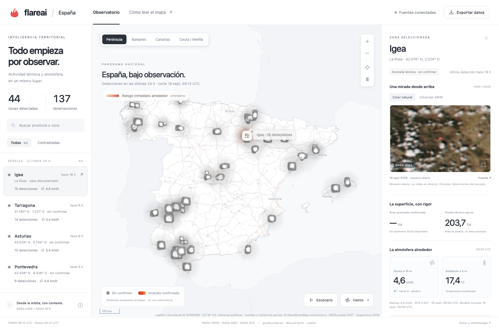
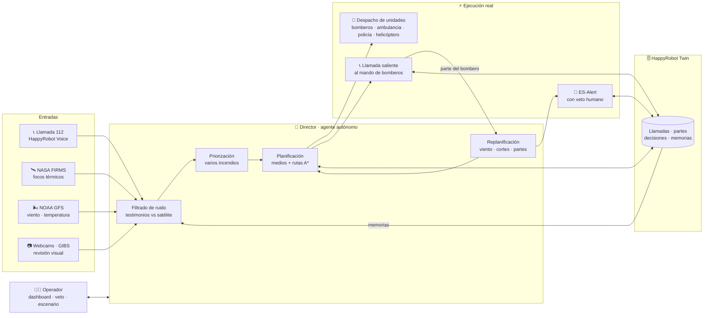

<p align="center">
  
</p>

<h1 align="center">🔥 FlareAI</h1>
<p align="center"><b>El agente autónomo que ve el incendio antes que nadie, decide bajo incertidumbre y moviliza medios reales.</b></p>
<p align="center">HackSpain 2026 · Reto HappyRobot</p>

<p align="center">
  <a href="https://flareai.onrender.com/"><b>🌐 Demo en vivo</b></a> ·
  <a href="TU-ENLACE-AL-VIDEO"><b>🎬 Vídeo completo</b></a> ·
  <a href="docs/IMPLEMENTACION.md">📐 Arquitectura técnica</a>
</p>

---

## El problema

En un incendio, el 112 recibe **cientos de llamadas en minutos**. Muchas se contradicen, algunas son falsas, ninguna tiene la foto completa. Mientras un humano intenta entender qué pasa, el fuego avanza con el viento.

**FlareAI convierte ese ruido en decisiones.** Cruza lo que dice la gente con lo que ven los satélites, decide qué atender primero, envía los medios y se replantea el plan cuando la situación cambia. Sin esperar a que alguien se lo pida.

## Qué hace, en 30 segundos

| | |
|---|---|
| 🛰️ **Observa desde el espacio** | Anomalías térmicas de **NASA FIRMS** (3 satélites VIIRS), viento y temperatura de **NOAA GFS**, imágenes **NASA GIBS** (color natural e infrarrojo SWIR) y **webcams públicas** verificadas. Todo sobre un mapa de España en tiempo real. |
| 📞 **Escucha al ciudadano** | Llamadas al 112 por voz con **HappyRobot**. El agente entiende la llamada, extrae ubicación y gravedad, y la geocodifica. |
| 🧠 **Filtra el ruido** | Cada aviso llega mezclado con testimonios coherentes, dudosos y bromas. El agente los **contrasta entre sí y con el satélite** antes de mover un solo camión. |
| 🚒 **Actúa de verdad** | Moviliza bomberos de distintos parques, ambulancias, policía y helicópteros sobre **rutas reales** (OSM). |
| 📲 **Llama de vuelta, como el 112** | Cuando las unidades llegan, el agente **llama por teléfono al mando de bomberos**, recoge su parte por voz y, si no contesta, salta al contacto de respaldo. Validado con llamadas reales. |
| ⚡ **Se adapta al instante** | Cambia el viento, se corta una vía, el bombero dice que empeora → el plan se rehace en el mismo tick. Varios incendios a la vez, priorizados. |
| 📱 **Alerta a la población** | Si el parte describe peligro para las personas (humos tóxicos, propagación a viviendas), el agente propone una **ES-Alert** que el operador puede vetar en 3 segundos. |
| 🗄️ **Todo sincronizado en HappyRobot** | El reto pedía implementarlo sobre su plataforma: la base de datos dinámica es **HappyRobot Twin**: llamadas, partes, decisiones, asignaciones y memorias viven ahí. Los workflows de voz y el agente director leen y escriben el mismo estado, así que todo queda coordinado y trazable. |
| 🧑‍✈️ **Humano al mando** | Dashboard donde se ve **qué piensa la IA y por qué**, con pausa, veto y un editor para introducir giros al escenario. |
| 📚 **Aprende** | Cada operación cerrada genera una memoria. **Cerebro** las conecta en un grafo y las inyecta en el contexto del agente para la siguiente decisión. |

## Datos basados en hechos reales

Nada de esto es un mapa de cartón. Todo lo que ve el agente existe:

- **Focos térmicos reales** de NASA FIRMS, descargados de los tres satélites VIIRS (SNPP, NOAA-20, NOAA-21) en las últimas 24 h.
- **Viento y temperatura reales** del modelo NOAA GFS, leídos directamente del GRIB2 y interpolados sobre cada foco.
- **Imágenes satelitales reales** de NASA GIBS, en color natural e infrarrojo SWIR, con su fecha de mosaico.
- **Parques de bomberos, hospitales, comisarías y helipuertos reales** de España, compilados en un atlas propio desde fuentes públicas.
- **Carreteras reales** de OpenStreetMap e IGN: las unidades siguen calles que existen, con sentidos de circulación.
- **Población y usos del suelo reales** (INE 2021, Copernicus 2019) alrededor de cada foco.
- **Webcams públicas reales**, de un catálogo de 2.900+ verificadas una a una.

**Datos reales sincronizados, y a partir de ahí, la simulación.** Sobre esa base real corre el escenario operativo: la flota, el avance del fuego y su extinción son simulados, y lo decimos en pantalla siempre que aparece. Todo lo que rodea al incendio —dónde está, qué viento sopla, qué parques y hospitales hay, por qué calles se llega— es verdad.

## Cómo funciona



**El ciclo completo:** llamada → contraste con satélite → decisión → despacho por carretera real → llamada de vuelta al mando de bomberos al llegar → parte por voz → replanificación → extinción → regreso → memoria para la próxima vez.

## Los detalles que importan

**Decisión bajo incertidumbre.** Una detección de la NASA no es un incendio confirmado, y una llamada tampoco. FlareAI distingue tres estados —*señal satelital*, *aviso ciudadano*, *confirmado por bomberos*— y solo escala cuando las fuentes convergen. Cada evidencia lleva su fecha y su origen: nunca vende una foto de ayer como directo.

**Prioridad estricta.** El agente maneja hasta ocho incendios por contexto y reparte una flota limitada: tres camiones de sedes distintas, ambulancias, patrulla, helicóptero solo si el parte lo justifica. Un aviso `crítico` escala; un fuego pequeño sin amenaza no roba medios a otro.

**Adaptación dinámica.** Las rutas se calculan con A* sobre la red viaria real de OSM (+ OSRM como respaldo). Un corte de vía elimina el tramo y recalcula desde la posición actual del vehículo; sin alternativa, la unidad se detiene y el agente lo sabe. El viento reorienta el frente y la evaluación de peligro.

**Coordinación multicanal.** Ciudadano (voz 112 entrante) · Mando de bomberos (llamada de vuelta automatizada, con respaldo) · Operador (dashboard) · Población (ES-Alert web) · Servicios (despacho de unidades). Cada canal recibe solo lo que necesita.

**Llamada de vuelta: el protocolo 112, automatizado.** En una sala del 112 real, el operador no espera: llama al mando desplegado para conocer la situación sobre el terreno. FlareAI hace exactamente eso, solo. Al llegar las unidades dispara una **llamada de voz saliente** con HappyRobot, conversa con el bombero, estructura su parte (fuego confirmado, evolución, refuerzos, peligro para la población) y lo devuelve al agente para replanificar. Si el principal no atiende, llama al respaldo; cada intento queda registrado antes de marcar y nunca se repite una llamada incierta. **Lo hemos validado con llamadas telefónicas reales**: principal ocupado → respaldo atendió y el parte completo entró en el sistema en 71 segundos. Es escalable por diseño: los contactos, prioridades y respaldos viven en Twin, no en código; añadir un parque, una comarca o un cuerpo nuevo es añadir filas.

**Ejecución real.** Las llamadas entrantes y salientes son reales vía HappyRobot; los despachos, partes y alertas son acciones del agente, no texto propuesto.

**La base de datos está en HappyRobot.** El reto pedía construir la solución sobre su plataforma, y lo hemos hecho de punta a punta: voz entrante, voz saliente, agente de razonamiento y base de datos. Usamos **HappyRobot Twin** como base de datos del sistema para todo lo dinámico: cada llamada 112, cada testimonio, cada parte de bomberos, cada decisión del agente, cada asignación de vehículo y cada memoria aprendida se guarda ahí. Es lo que sincroniza las piezas: el workflow de voz escribe la ficha de la llamada, el director la lee y escribe su plan, la llamada saliente al bombero escribe el parte, y el director vuelve a leerlo para replanificar. Todo con un único director activo por sala (lease renovable, recuperación automática si se cae) y un histórico consultable. Lo estático —atlas de emergencias, cartografía, cachés de NASA/NOAA— queda en PostgreSQL local para no mover gigas que no cambian.

**Memoria y autoaprendizaje: el agente aprende.** Al cerrar cada operación, el sistema analiza lo que ha pasado —qué medios se enviaron, cuánto tardaron, qué dijo el bombero, si hizo falta reforzar, si la alerta fue necesaria— y lo condensa en una memoria breve guardada en HappyRobot Twin. En la siguiente decisión, el agente recibe esas memorias en su contexto: no empieza de cero, arranca sabiendo qué funcionó y qué no en incendios anteriores y ajusta su comportamiento. Cuantas más operaciones, mejor decide. **Cerebro** muestra ese conocimiento como un grafo navegable de notas enlazadas, para que el operador vea qué ha aprendido la IA y por qué.

**Impacto económico.** Cada operación cierra con un balance: superficie preservada, CO₂ evitado y su valor en tres escenarios de precio del carbono (10/30/60 €/t). Es la puerta a un modelo donde aseguradoras y bonos de carbono financian la detección temprana.

## Lo que pedía el reto, resuelto

| Requisito | Cómo lo hace FlareAI |
|---|---|
| **Sistema agéntico** — decide y actúa solo | No hay chatbot. El director recibe avisos y decide por sí mismo qué medios enviar, desde qué parques, si hace falta helicóptero, cuándo llamar al mando, cuándo proponer una alerta y cuándo retirar. Nadie le pregunta nada: actúa. |
| **Escenario dinámico** — la crisis cambia en ejecución | El fuego crece con el tiempo, el viento gira, aparecen cortes de vía, llegan partes que dicen que empeora, entran nuevos incendios. El agente recalcula rutas desde la posición actual de cada vehículo y rehace el plan en el mismo tick. Cualquiera puede introducir estos giros desde el editor del dashboard. |
| **Respuesta multipaso** — cadena de acciones | Llamada → contraste con satélite → priorización → despacho → ruta real → llegada → llamada de vuelta al bombero → parte → refuerzo o alerta → extinción → regreso → informe → memoria. Cada paso depende del anterior y persigue un objetivo: apagar el fuego sin poner a nadie en peligro. |
| **Interacción de verdad** — llamadas, datos, sistemas | Voz entrante 112 y **voz saliente real** al mando de bomberos con HappyRobot (validada con llamadas telefónicas reales). Todo el estado se escribe y se lee en **HappyRobot Twin** (base de datos relacional). Rutas contra OSM/OSRM, datos de NASA, NOAA, IGN e INE. |
| **Human-in-the-loop** — dashboard y control con 1 clic | El mapa muestra en todo momento qué hace la IA y por qué (marco de "pensando", decisiones con su razón, evidencias fechadas). El operador puede **pausar**, **vetar una ES-Alert con un clic en 3 segundos**, reanudar el seguimiento y meter giros al escenario. |
| **BONUS · aprende de interacciones** | Al cerrar cada operación, el agente revisa lo ocurrido —llamadas, partes, tiempos, refuerzos, alertas— y lo condensa en memorias que entran en su contexto en la siguiente decisión. Ajusta su comportamiento de forma autónoma; Cerebro lo hace visible. |

## Stack

- **Backend:** Python 3.13, servidor HTTP stdlib, sin frameworks. PostgreSQL para atlas territorial e histórico; SQLite + RTree para el atlas de emergencias (parques, hospitales, comisarías, helipuertos).
- **Agente:** HappyRobot Reasoning Agent (director) + workflows de voz entrante (112) y saliente (bomberos). **HappyRobot Twin como base de datos** de llamadas, partes, decisiones, asignaciones y memorias.
- **Datos:** NASA FIRMS · NASA GIBS · NOAA GFS (GRIB2 parcial) · IGN · INE · OpenStreetMap · catálogo de 2.900+ webcams públicas verificadas.
- **Frontend:** Leaflet + Canvas 2D propio (fuego animado, partículas de viento, cartografía en un solo canvas para 110k vértices a 60 fps). Sin build.
- **Escalabilidad:** el observatorio ya cubre toda España; el escenario operativo se prepara por zona (grafo viario descargado una vez y cacheado). Añadir una ciudad es preparar sus teselas.

## Sobre la demo pública

Te hemos hecho un despliegue en **[flareai.onrender.com](https://flareai.onrender.com/)** para que puedas ver la interfaz.

Entendemos que no vas a poder hacer las llamadas al 112, así que en ese despliegue **el sistema ya te activa un incendio directamente** y puedes ver cómo el agente despacha los medios, los mueve por carreteras reales, los va apagando y qué decisiones toma. Puedes cambiar el viento, la potencia del fuego o cortar una vía desde el editor (lápiz rojo) y ver cómo reacciona.

**Es posible que los mapas no te carguen bien.** Las APIs que usamos tienen limitaciones y se saturan. Nosotros hemos hecho un sistema local que lo carga mucho más rápido, pero por las limitaciones del hosting gratuito no hemos podido desplegarlo del todo bien.

Si necesitas probarlo en condiciones, **escríbenos a (mail no disponible)** y te pasamos la URL de un túnel a nuestro ordenador en un momento. O míralo en el **vídeo**: ahí se ve bien cómo funciona todo y cómo reacciona a las llamadas y a los distintos inputs.

## Ejecutar en local

```bash
python database.py start && python database.py import   # PostgreSQL local
python app.py --presentation --host 127.0.0.1 --port 8090
```

Requiere `FLAREAI_TWIN_API_KEY` y la configuración de HappyRobot (`happyrobot-112/.env`). Sin claves, `python app.py --offline` levanta el observatorio con datos congelados. Detalle completo en [`docs/IMPLEMENTACION.md`](docs/IMPLEMENTACION.md) y [`docs/DESPLIEGUE_RENDER.md`](docs/DESPLIEGUE_RENDER.md).

---

<p align="center"><i>Todo empieza por observar.</i></p>
