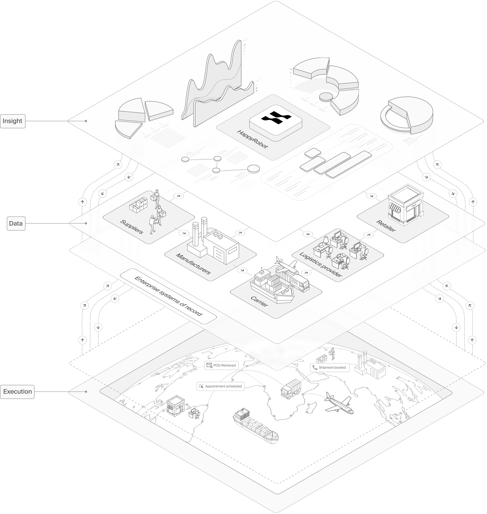

# Platform overview

> Architecture and key concepts of the HappyRobot platform

HappyRobot is enterprise-grade infrastructure for building and orchestrating AI workforces. From a single platform, teams deploy fully custom AI workers that operate across voice, email, SMS, WhatsApp, and chat - integrating directly with your business systems to make decisions, execute actions, and communicate, all within a single workflow.

## Architecture

<Frame caption="HappyRobot platform architecture: Insight, Data, and Execution layers">
  
</Frame>

Triggers arrive through communication channels (phone calls, SMS, WhatsApp messages, emails) or via API. The workflow engine orchestrates execution across a directed graph of nodes — AI conversations, integration actions, data extraction, conditional logic, and more. Each execution is captured as a run with full transcripts, recordings, and node-level output tracking.

## Key concepts

<AccordionGroup>
  <Accordion title="Workflows">
    A workflow is the top-level container for an automation — similar to a project. Each workflow has a unique slug used for API triggers, contains a directed graph of nodes that defines execution logic, and maintains a history of versions and execution runs.

    You manage workflows from the platform at [platform.happyrobot.ai](https://platform.happyrobot.ai). Each workflow belongs to an organization and can be configured with environment-specific settings for development, staging, and production. Workflows support branching, parallel paths, and conditional logic. When a trigger fires, the workflow engine executes nodes in sequence, passing data between them.

    You build workflows in the visual editor by adding nodes, connecting them, and configuring each node's behavior. See [Workflows](../02-Workflows/01-Workflows-Overview.md) for details.
  </Accordion>

  <Accordion title="Nodes">
    Nodes are individual steps in a workflow. There are four primary node types:

    * **Action nodes** execute integration events — sending emails, creating records, querying databases.
    * **Prompt nodes** run AI conversations — voice calls, SMS threads, chatbot sessions.
    * **Tool nodes** perform function calls and utility operations.
    * **Condition nodes** add branching logic based on data from previous nodes.

    HappyRobot also provides core nodes for common operations: [AI Extract](../03-Core-Nodes/02-AI-Extract.md), [AI Classify](../03-Core-Nodes/03-AI-Classify.md), [AI Generate](../03-Core-Nodes/04-AI-Generate.md), [Custom Code](../03-Core-Nodes/05-Custom-Code.md), [Webhook](../03-Core-Nodes/06-Webhook.md), [Schedule](../03-Core-Nodes/07-Schedule.md), [File Operations](../03-Core-Nodes/08-File-Operations.md), and [Conditionals](../03-Core-Nodes/09-Conditionals.md).
  </Accordion>

  <Accordion title="Agents">
    Agents handle AI conversations with users. There are two categories:

    * **Voice agents** manage phone calls over SIP and WebRTC. They combine speech-to-text (STT), a language model (LLM), and text-to-speech (TTS) into a real-time conversation pipeline. See [Voice agents](../05-Voice-Agents/01-Voice-Agents-Overview.md).
    * **Text agents** handle written communication over SMS, WhatsApp, email, and embedded chatbot. See [Text agents](../06-Text-Agents/01-Text-Agents-Overview.md).

    Both types are configured as prompt nodes within workflows, giving you control over system prompts, model selection, available tools, and conversation behavior.
  </Accordion>

  <Accordion title="Integrations">
    Integrations connect HappyRobot to external systems. There are 19+ integrations across three categories:

    * **Communication** — Gmail, Outlook, Slack, Microsoft Teams, Twilio SMS, WhatsApp, SendGrid, HappyRobot Email
    * **Business systems** — McLeod TMS, Turvo TMS, TPro, 3PL, Custom TMS, Broker App
    * **Data and storage** — Google Sheets, Snowflake, Redis

    Each integration provides triggers (events that start workflows) and actions (operations that workflows can execute). See [Integrations](../15-Integrations/01-Integrations-Overview.md).
  </Accordion>

  <Accordion title="Runs">
    A run is a single execution of a workflow. When a workflow is triggered, HappyRobot creates a run that tracks:

    * Execution status (queued, in progress, completed, failed)
    * Output from each node
    * Call recordings and transcripts (for voice runs)
    * Messages exchanged during agent conversations
    * Duration and billing data

    You can view runs in the platform or query them through the [API](https://docs.happyrobot.ai/api-reference/overview). See [Runs and monitoring](../09-Runs-and-Monitoring/01-Runs-Overview.md).
  </Accordion>

  <Accordion title="Contacts">
    Contacts are automatically created from interactions. When someone calls, texts, or emails your agents, HappyRobot creates or updates a contact record that tracks:

    * Interaction history across all channels
    * Extracted attributes from conversations
    * Persistent memories that agents reference in future interactions

    See [Contacts](../13-Contacts/01-Contacts-Overview.md).
  </Accordion>

  <Accordion title="Versions and environments">
    HappyRobot supports versioning and environment-based deployment. You can create versions of your workflow configuration, deploy to development, staging, or production environments, test changes before they go live, and roll back instantly if needed.

    See [Versions and publishing](../02-Workflows/08-Versions-and-Publishing.md) and [Environments](../02-Workflows/09-Environments.md).
  </Accordion>
</AccordionGroup>

## How it works

Here is what happens when an inbound phone call reaches HappyRobot:

<Steps>
  <Step title="Trigger fires">
    A call arrives on a phone number assigned to a workflow. HappyRobot detects the inbound call trigger and starts a new run.
  </Step>

  <Step title="Workflow executes">
    The workflow engine begins executing nodes in order. It evaluates conditions, runs integrations, and routes the call to the appropriate agent.
  </Step>

  <Step title="Agent converses">
    The voice agent joins the call. It uses STT to understand the caller, an LLM to generate responses, and TTS to speak them back — all in real time. The agent can call tools and access knowledge bases during the conversation.
  </Step>

  <Step title="Actions run">
    After the conversation, downstream nodes execute — updating records in your TMS, sending follow-up emails, writing data to a spreadsheet, or triggering another workflow.
  </Step>

  <Step title="Run completes">
    The run finishes with a full record: transcript, recording, node outputs, extracted data, and execution metadata. The contact record is updated with new interaction history and memories.
  </Step>
</Steps>

## Sending feedback

Open the workspace menu in the sidebar and choose **Feedback** to send a note to the HappyRobot team without leaving the platform. Pick a category — **Feature request**, **Bug report**, **Billing issue**, or **Other** — describe what you ran into, and submit. Press <kbd>Cmd</kbd>/<kbd>Ctrl</kbd> + <kbd>Enter</kbd> in the text box to submit without reaching for the mouse.

## What to explore next

<CardGroup cols={3}>
  <Card icon="rocket" href="03-Quickstart.md" title="Quickstart">
    Build a voice agent and trigger it via API.
  </Card>

  <Card icon="diagram-project" href="../02-Workflows/01-Workflows-Overview.md" title="Workflows">
    Design multi-step automation logic.
  </Card>

  <Card icon="phone" href="../05-Voice-Agents/01-Voice-Agents-Overview.md" title="Voice agents">
    Configure inbound and outbound voice AI.
  </Card>

  <Card icon="message" href="../06-Text-Agents/01-Text-Agents-Overview.md" title="Text agents">
    Deploy agents over SMS, WhatsApp, email, and chatbot.
  </Card>

  <Card icon="plug" href="../15-Integrations/01-Integrations-Overview.md" title="Integrations">
    Connect to external systems and services.
  </Card>

  <Card icon="code" href="https://docs.happyrobot.ai/api-reference/overview" title="API reference">
    Trigger workflows and query data programmatically.
  </Card>
</CardGroup>

---

Fuente original: https://docs.happyrobot.ai/platform-overview
