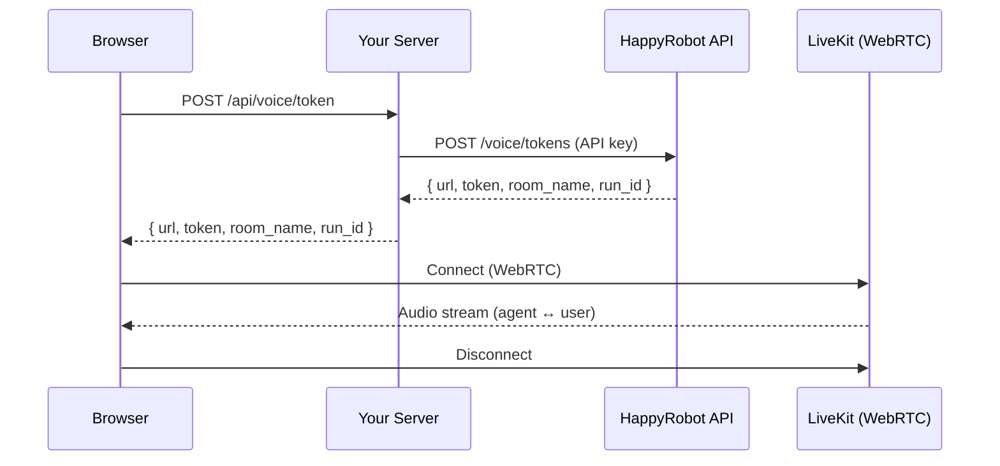

# Voice call tutorial

> Build a browser voice call UI with the TypeScript SDK using React, LiveKit, and Express

This tutorial walks through building a full-stack voice call application using `@happyrobot-ai/sdk`. You'll create a backend server that securely issues LiveKit tokens and a React frontend that connects via WebRTC for real-time audio with an AI agent.

The finished project is available at [github.com/happyrobot-ai/voice-sdk-example](https://github.com/happyrobot-ai/voice-sdk-example) — clone it to skip ahead or use it as a reference.

## Architecture

The SDK uses a **two-tier auth model** — your server holds the API key and creates scoped LiveKit tokens. The browser connects directly to LiveKit for real-time audio without ever seeing your API key.



## Prerequisites

* Node.js 18+
* A HappyRobot API key (`sk_live_...`)
* A workflow ID with a **Web Call** trigger node

## Steps

<Steps>
  <Step title="Set up the project">
    Create the project structure with separate `server` and `client` directories:

    ```bash theme={null}
    mkdir voice-call-example && cd voice-call-example
    mkdir server client
    ```

    Initialize and install server dependencies:

    <CodeGroup>
      ```bash npm theme={null}
      cd server && npm init -y
      npm install express cors @happyrobot-ai/sdk
      npm install -D typescript tsx @types/express @types/cors
      ```

      ```bash pnpm theme={null}
      cd server && pnpm init
      pnpm add express cors @happyrobot-ai/sdk
      pnpm add -D typescript tsx @types/express @types/cors
      ```

      ```bash yarn theme={null}
      cd server && yarn init -y
      yarn add express cors @happyrobot-ai/sdk
      yarn add -D typescript tsx @types/express @types/cors
      ```
    </CodeGroup>

    Initialize and install client dependencies:

    <CodeGroup>
      ```bash npm theme={null}
      cd ../client
      npm create vite@latest . -- --template react-ts
      npm install @happyrobot-ai/sdk livekit-client
      ```

      ```bash pnpm theme={null}
      cd ../client
      pnpm create vite . --template react-ts
      pnpm add @happyrobot-ai/sdk livekit-client
      ```

      ```bash yarn theme={null}
      cd ../client
      yarn create vite . --template react-ts
      yarn add @happyrobot-ai/sdk livekit-client
      ```
    </CodeGroup>

    <Note>
      `livekit-client` is an optional peer dependency of `@happyrobot-ai/sdk` — it's only needed when you import from `@happyrobot-ai/sdk/voice`.
    </Note>
  </Step>

  <Step title="Configure environment variables">
    Create `server/.env` with your API key and workflow ID:

    ```bash theme={null}
    HAPPYROBOT_API_KEY=sk_live_...
    WORKFLOW_ID=your-voice-workflow-id
    PORT=3001
    ```

    <Warning>
      Never expose your API key to the browser. The server acts as a secure proxy that exchanges the key for a scoped LiveKit token.
    </Warning>
  </Step>

  <Step title="Create the token server">
    Create `server/src/index.ts`. This Express server has a single endpoint that creates LiveKit tokens for voice calls:

    ```ts server/src/index.ts theme={null}
    import express from "express";
    import cors from "cors";
    import { HappyRobotClient } from "@happyrobot-ai/sdk";

    const PORT = process.env.PORT ?? 3001;
    const API_KEY = process.env.HAPPYROBOT_API_KEY;
    const WORKFLOW_ID = process.env.WORKFLOW_ID;

    if (!API_KEY) {
      console.error("Missing HAPPYROBOT_API_KEY environment variable");
      process.exit(1);
    }

    if (!WORKFLOW_ID) {
      console.error("Missing WORKFLOW_ID environment variable");
      process.exit(1);
    }

    const client = new HappyRobotClient({ apiKey: API_KEY });

    const app = express();
    app.use(cors({ origin: "http://localhost:5173" }));
    app.use(express.json());

    app.post("/api/voice/token", async (_req, res) => {
      try {
        const result = await client.voice.createToken({
          workflow_id: WORKFLOW_ID,
          // Optional. LiveKit token lifetime in seconds.
          // Default 21600 (6 hours), min 60, max 86400 (24 hours).
          // LiveKit does not refresh tokens on an active call — the browser
          // must reconnect if the call outlives the TTL.
          // ttl_seconds: 3600,
        });
        res.json(result);
      } catch (err) {
        console.error("Failed to create voice token:", err);
        res.status(500).json({ error: "Failed to create voice token" });
      }
    });

    app.listen(PORT, () => {
      console.log(`Server listening on http://localhost:${PORT}`);
    });
    ```

    Add a dev script to `server/package.json`:

    ```json theme={null}
    {
      "scripts": {
        "dev": "tsx --env-file=.env src/index.ts"
      }
    }
    ```

    The `client.voice.createToken()` response includes:

    | Field       | Description                  |
    | ----------- | ---------------------------- |
    | `url`       | LiveKit WebSocket URL        |
    | `token`     | Scoped LiveKit access token  |
    | `room_name` | The room name for this call  |
    | `run_id`    | Workflow run ID for tracking |
  </Step>

  <Step title="Build the voice call client">
    Replace `client/src/App.tsx` with the voice call UI. The client follows this lifecycle:

    1. Fetch a token from your server
    2. Create a `HappyRobotVoiceClient` with the `url` and `token`
    3. Connect to the room (enables microphone automatically)
    4. Handle room events (agent joining, disconnection, etc.)

    ```ts client/src/App.tsx theme={null}
    import { useState, useRef, useCallback } from "react";
    import { HappyRobotVoiceClient } from "@happyrobot-ai/sdk/voice";
    import type { VoiceConnection } from "@happyrobot-ai/sdk/voice";

    const SERVER_URL = "http://localhost:3001";

    export function App() {
      const [isConnected, setIsConnected] = useState(false);
      const [isMuted, setIsMuted] = useState(false);
      const connectionRef = useRef<VoiceConnection | null>(null);

      const startCall = useCallback(async () => {
        // 1. Get a voice token from your server
        const res = await fetch(`${SERVER_URL}/api/voice/token`, {
          method: "POST",
        });
        const { url, token } = await res.json();

        // 2. Create the voice client
        const voiceClient = new HappyRobotVoiceClient({ url, token });

        // 3. Connect to the room
        const connection = await voiceClient.connect({
          onConnected: () => setIsConnected(true),
          onDisconnected: () => {
            setIsConnected(false);
            setIsMuted(false);
            connectionRef.current = null;
          },
          onAgentConnected: (participant) => {
            console.log("Agent joined:", participant.identity);
          },
          onError: (err) => console.error("Voice error:", err),
        });

        connectionRef.current = connection;
      }, []);

      const endCall = useCallback(async () => {
        await connectionRef.current?.disconnect();
        connectionRef.current = null;
        setIsConnected(false);
        setIsMuted(false);
      }, []);

      const toggleMute = useCallback(async () => {
        if (!connectionRef.current) return;
        if (isMuted) {
          await connectionRef.current.unmute();
          setIsMuted(false);
        } else {
          await connectionRef.current.mute();
          setIsMuted(true);
        }
      }, [isMuted]);

      return (
        <div>
          {!isConnected ? (
            <button onClick={startCall}>Start Call</button>
          ) : (
            <>
              <button onClick={toggleMute}>{isMuted ? "Unmute" : "Mute"}</button>
              <button onClick={endCall}>End Call</button>
            </>
          )}
        </div>
      );
    }
    ```

    The key room events to handle:

    | Event               | Description                                |
    | ------------------- | ------------------------------------------ |
    | `onConnected`       | Connected to the LiveKit room              |
    | `onDisconnected`    | Disconnected from the room                 |
    | `onAgentConnected`  | AI agent joined the room                   |
    | `onReconnecting`    | Connection temporarily lost                |
    | `onReconnected`     | Successfully reconnected                   |
    | `onTrackSubscribed` | Remote audio track subscribed (auto-plays) |
    | `onError`           | An error occurred                          |
  </Step>

  <Step title="Pass data to the agent">
    You can pass contextual data to the voice agent as participant attributes. These are forwarded to the workflow as trigger parameters:

    ```ts theme={null}
    const result = await client.voice.createToken({
      workflow_id: WORKFLOW_ID,
      data: {
        customer_name: "John Doe",
        order_id: "ORD-12345",
      },
    });
    ```

    The `data` keys must match the parameters configured on the Web Call trigger node in your workflow. If your trigger expects `customer_name` and `order_id`, you must pass both.
  </Step>

  <Step title="Run the app">
    Start both the server and client in separate terminals:

    ```bash theme={null}
    # Terminal 1 — server (port 3001)
    cd server && npm run dev

    # Terminal 2 — client (port 5173)
    cd client && npm run dev
    ```

    Open [http://localhost:5173](http://localhost:5173) and click **Start Call** to begin a voice conversation with your agent. Make sure your browser has microphone permissions enabled.
  </Step>
</Steps>

## Listen to a live call

You can join a call that's already in progress as a silent observer. Pass the
`session_id` of the live session and leave `should_takeover` unset: the SDK returns a
token for that session's existing room, scoped so the participant is hidden and can
only subscribe to audio. The AI agent stays on the call and nothing about the
conversation changes.

```ts server/src/index.ts theme={null}
app.post("/api/live-session/:sessionId/listen-token", async (req, res) => {
  try {
    const result = await client.voice.createToken({
      session_id: req.params.sessionId,
    });
    res.json(result);
  } catch (err) {
    console.error("Failed to create listen token:", err);
    res.status(500).json({ error: "Failed to create listen token" });
  }
});
```

In the browser, call `listen()` instead of `connect()`. It joins the room without
requesting microphone access and without publishing anything:

```ts client/src/App.tsx theme={null}
const { url, token } = await fetch(
  `/api/live-session/${sessionId}/listen-token`,
  { method: "POST" }
).then((r) => r.json());

const voice = new HappyRobotVoiceClient({ url, token });
const listener = await voice.listen();

// If the browser blocks autoplay, call this from a click handler:
await listener.startAudio();

// Stop listening. The call keeps going.
await listener.disconnect();
```

`listen()` takes the same handlers as `connect()` and returns a
`VoiceListenerConnection` — `disconnect()`, `startAudio()`, and the underlying `room`.
There are no mute controls because there's nothing to mute.

<Note>
  An observer token needs permission to **view runs** for the workflow, which is a
  lower bar than starting or taking over a call. Several observers can listen to the
  same session at once.
</Note>

The same thing is available in the platform UI — see
[Listening to a call in progress](../../01-Developer-Guide/09-Runs-and-Monitoring/04-Recordings.md#listening-to-a-call-in-progress).

## Take over a live call

You can also have a human join a call and take it over from the AI agent. Pass the
`session_id` of the live session along with `should_takeover: true`. The SDK returns a
token for that session's existing room; when the human connects, the AI agent drops and
the human continues the call.

```ts server/src/index.ts theme={null}
app.post("/api/voice/takeover", async (req, res) => {
  try {
    const result = await client.voice.createToken({
      session_id: req.body.session_id,
      should_takeover: true,
    });
    res.json(result);
  } catch (err) {
    console.error("Failed to create takeover token:", err);
    res.status(500).json({ error: "Failed to create takeover token" });
  }
});
```

The browser then connects exactly like a normal call — create a `HappyRobotVoiceClient`
with the returned `url` and `token` and call `connect()`. Because the token is scoped to
the live session's room, the human joins that ongoing conversation directly.

<Note>
  `should_takeover: true` is an explicit opt-in so a takeover is never a surprise, and
  it's only valid alongside `session_id`. A takeover token requires permission to
  trigger the workflow, because it changes the live call.
</Note>

Only **in-progress** sessions can be observed or taken over. Provide exactly one of
`workflow_id` (start a new call) or `session_id` (observe or take over an existing one).

## Error handling

The SDK exports typed error classes for common failure scenarios:

```ts theme={null}
import { ApiError, AuthenticationError, NotFoundError } from "@happyrobot-ai/sdk";

try {
  await client.voice.createToken({ workflow_id: "bad-id" });
} catch (err) {
  if (err instanceof NotFoundError)        console.log("Workflow not found");
  else if (err instanceof AuthenticationError) console.log("Invalid API key");
  else if (err instanceof ApiError)        console.log(err.status, err.message);
}
```

Common errors from the voice token endpoint:

| Status | Cause                                                                                                               |
| ------ | ------------------------------------------------------------------------------------------------------------------- |
| 404    | Workflow not found, no live version, no Web Call node, or session not found                                         |
| 400    | Missing required `data` keys, both/neither of `workflow_id`/`session_id`, or `should_takeover` without `session_id` |
| 409    | The `session_id` refers to a session that is not in progress                                                        |
| 500    | LiveKit not configured on the server                                                                                |

## SDK reference

### Server-side — `HappyRobotClient`

| Method                                                                          | Description                                                                                                                                                                                |
| ------------------------------------------------------------------------------- | ------------------------------------------------------------------------------------------------------------------------------------------------------------------------------------------ |
| `client.voice.list({ language? })`                                              | List the voices available to the workspace. `language` accepts a prefix like `en` or a locale like `en-GB`. See [Listing voices with the API](../../01-Developer-Guide/14-Assets/04-Voices.md#listing-voices-with-the-api). |
| `client.voice.createToken({ workflow_id, data?, env?, ttl_seconds? })`          | Create a LiveKit token to start a new voice call. `ttl_seconds` defaults to 21600 (min 60, max 86400).                                                                                     |
| `client.voice.createToken({ session_id, ttl_seconds? })`                        | Create a hidden, subscribe-only observer token for an in-progress session. The AI agent stays active.                                                                                      |
| `client.voice.createToken({ session_id, should_takeover: true, ttl_seconds? })` | Create a token to take over an in-progress session. `should_takeover: true` drops the AI agent.                                                                                            |

### Browser-side — `HappyRobotVoiceClient`

| Method                                      | Description                                                                         |
| ------------------------------------------- | ----------------------------------------------------------------------------------- |
| `new HappyRobotVoiceClient({ url, token })` | Create client with LiveKit credentials                                              |
| `voice.connect(handlers?)`                  | Connect to room, enable microphone — returns `VoiceConnection`                      |
| `voice.listen(handlers?)`                   | Connect without microphone access or publishing — returns `VoiceListenerConnection` |

### `VoiceConnection`

| Method                    | Description                                               |
| ------------------------- | --------------------------------------------------------- |
| `connection.disconnect()` | End the call and disconnect from the room                 |
| `connection.mute()`       | Mute the local microphone                                 |
| `connection.unmute()`     | Unmute the local microphone                               |
| `connection.isMuted()`    | Check mute state                                          |
| `connection.room`         | Underlying LiveKit `Room` instance for advanced use cases |

### `VoiceListenerConnection`

| Method                  | Description                                               |
| ----------------------- | --------------------------------------------------------- |
| `listener.disconnect()` | Stop listening without affecting the call                 |
| `listener.startAudio()` | Resume audio playback from a browser user gesture         |
| `listener.room`         | Underlying LiveKit `Room` instance for advanced use cases |

## Next steps

* See the [complete example on GitHub](https://github.com/happyrobot-ai/voice-sdk-example) with a full React UI, event log, and connection status handling
* Read the [Error handling](13-Error-handling.md) guide for more on SDK error types
* Check out the [Chatbot tutorial](05-Chatbot-tutorial.md) for building text-based chat UIs

---

Fuente original: https://docs.happyrobot.ai/developer-tools/sdk/voice-call-tutorial
